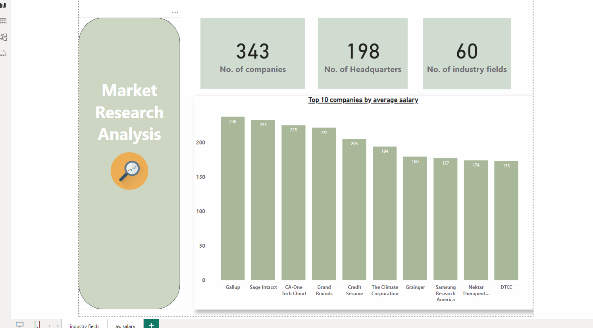
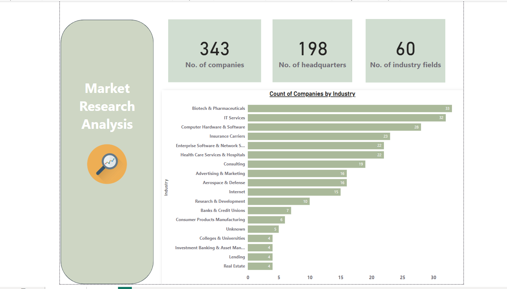

# 📊 Market Research Analysis

Welcome to the **Market Research Analysis** project! This project leveraged Power BI to explore market data, providing a comprehensive view of companies across industries. Below are the key highlights of the analysis:

## 🚀 Key Features of the Analysis

- **📈 Data Analysis of Companies and Industries**:  
  Analyzed data for **343 companies** across **60 industry fields**.

- **🌍 Market Distribution Insights**:  
  Displayed the number of headquarters and industry fields to enhance understanding of market distribution.

- **📊 Bar Chart Visualization**:  
  Created a bar chart to showcase the count of companies by industry.

- **💼 Top 10 Companies by Average Salary**:  
  Highlighted the top 10 companies by average salary through impactful visualizations.

## 🧐 Insights Gained

This analysis provided valuable perspectives on:  
- 📊 **Market Trends**  
- 💸 **Salary Distribution**  
- 🌟 **Industry Representation**

## 📁 Files and Resources

- Data: `market_research_data.csv`
- Visualizations:  
  - Industry Bar Chart (`industry_bar_chart.png`)  
  - Top 10 Companies by Salary (`top_10_salary_chart.png`)

## 📊 Visualization Example

Here's a sneak peek at one of the visualizations from the analysis:

---

Feel free to explore the data and reach out with any questions! 😊
